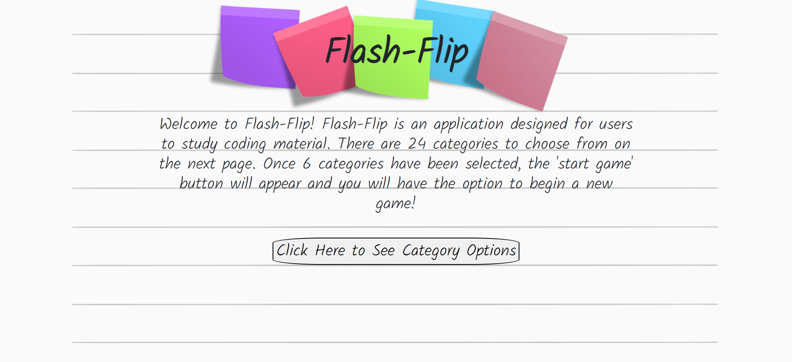
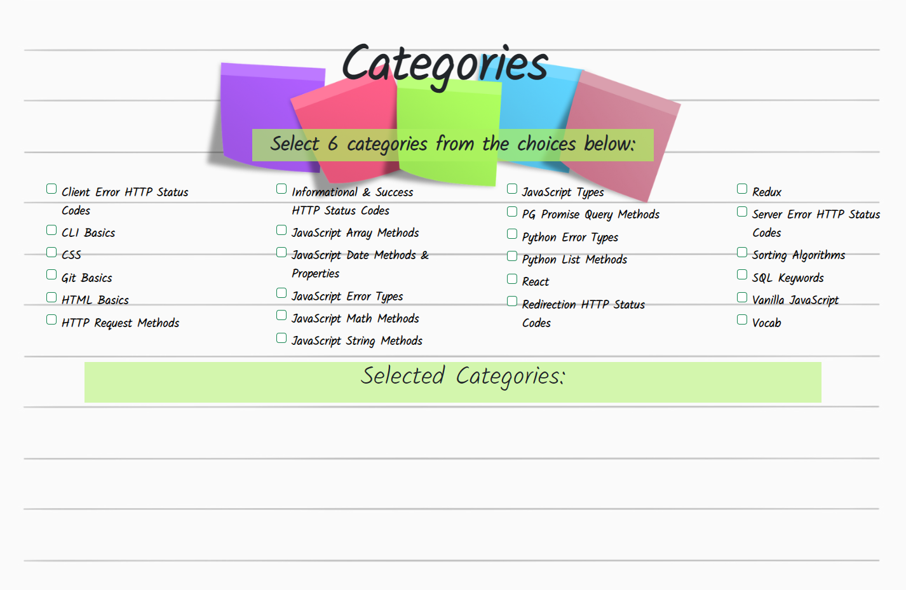
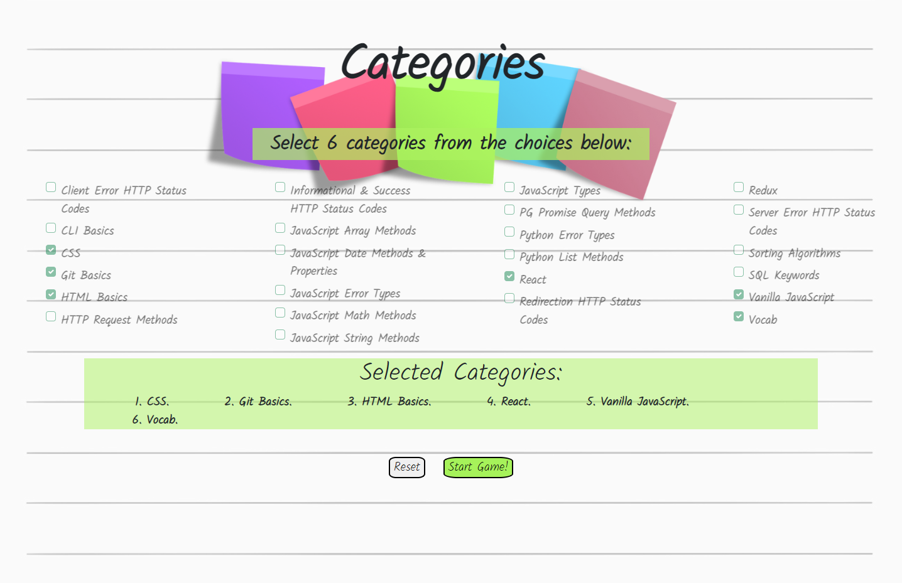
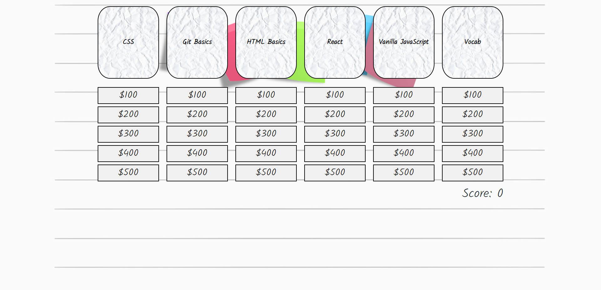
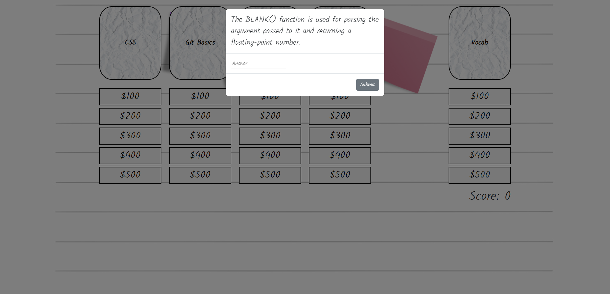
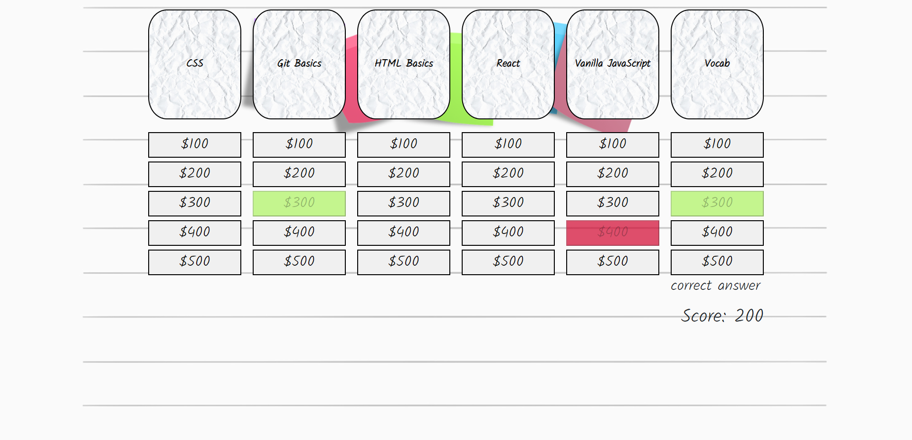
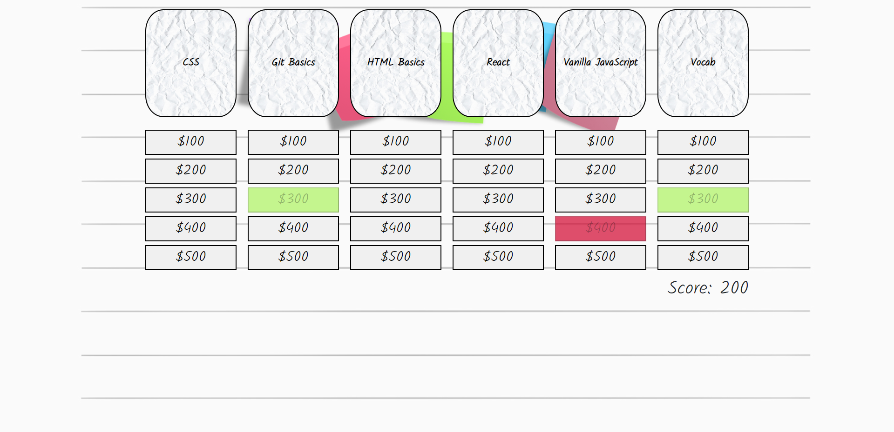
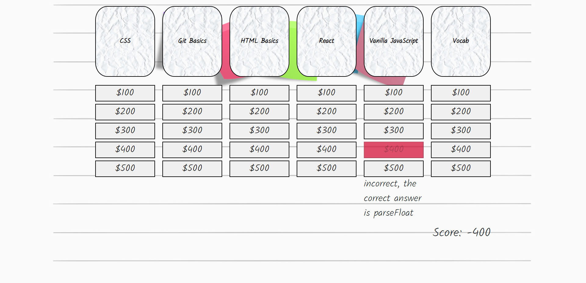
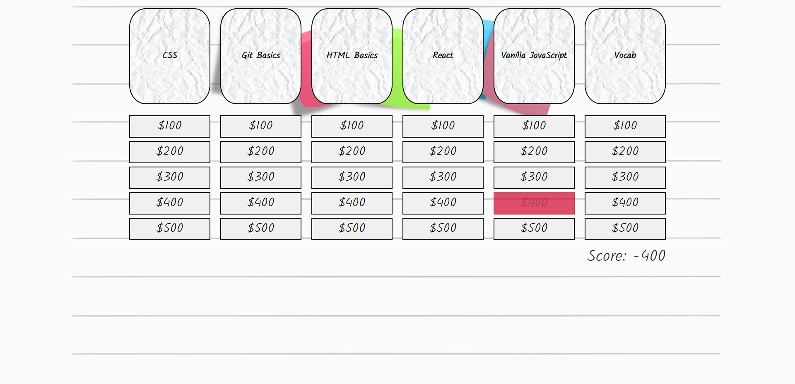
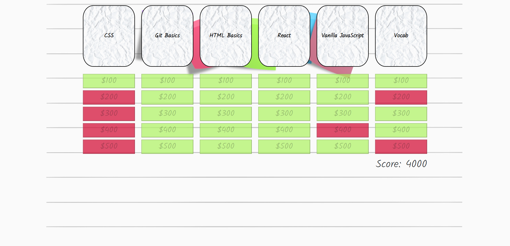

<h1 align="center">Flash-Flip</h1>

<h2 align="center"> :books: A game that will test your knowledge on various coding materials :books: </h2>

---

##Live Sites 
---

##Video of Gameplay
---

[silent-visual-walk-through.webm](https://user-images.githubusercontent.com/99201856/221380298-15639557-7d3a-4250-b6c0-13c262d218c2.webm)

##Contents
--- 
  * What It Is
  * Tech Stack
  * MVP
  * Stretch Goals
  * Screenshots

##What It Is
---
Flash-Flip is a game designed for students to better understand the core concepts of full-stack web development. This game includes 24 categories, and each category has five levels of difficulty. In order to begin playing, the user must select 6 categories and click the 'Start Game!' button. 

Once the game has started a score will appear. The score will update throughout the game until all of the questions have been answered.

This is an independent project built using primarily React and Redux.

##Tech Stack
---
  * React
  * Redux
  * Bootstrap
  * CSS3

##MVP (Minimum Viable Product)
---  
The MVP included:
  * Allowing the user to select from a variety of coding categories
  * Each category has 5 levels of difficulty
  * Questions are randomized according to their level and category
  * Use redux to ensure a score is kept
  * Conditional rendering of the landing page, categories, and game play
  * When the answer is incorrect, display the correct answer
  * Allowing only one attempt per question
  * A mobile responsive design

##Stretch Goals
---
Here is what the second level IVP (Intermediate Viable Product) will feature:
  * Set up server
  * Create categories
  * Multi-Player option
  * Global scoreboard
  * Customizable profiles

##Screenshots
---
Landing Page 

Category Choices

Selected Categories

Begin Game

Question Modal

Correct Answer

Correct Notification Removed After Timeout

Incorrect Answer 

Incorrect Answer Notification Removed After Timeout 

End Game

